# ComfyUI-Logic

ComfyUI 逻辑工具节点包，提供工作流控制、条件判断、数据预览与批处理功能。

ComfyUI logic utility nodes - workflow control, conditional logic, universal preview, batch processing, type conversion, math expressions, and video processing. **i18n**: UI follows ComfyUI language (zh/en).

## 安装

将本仓库克隆到 ComfyUI 的 `custom_nodes` 目录：

```bash
cd ComfyUI/custom_nodes
git clone https://github.com/playboy-dongan/ComfyUI-Logic.git
```

重启 ComfyUI 即可使用，无额外依赖。

## 节点列表

### 1. 🚧 阻断器（Blocker）

根据布尔开关决定是否放行数据。  
*Pass or block data based on a boolean switch.*

| 项目 | 内容 |
|------|------|
| 输入 | 任意类型 + 布尔开关（通过/阻断） |
| 输出 | 原样透传 或 静默阻断下游 |
| 特性 | 节点颜色随状态实时变化（绿=通过，红=阻断） |

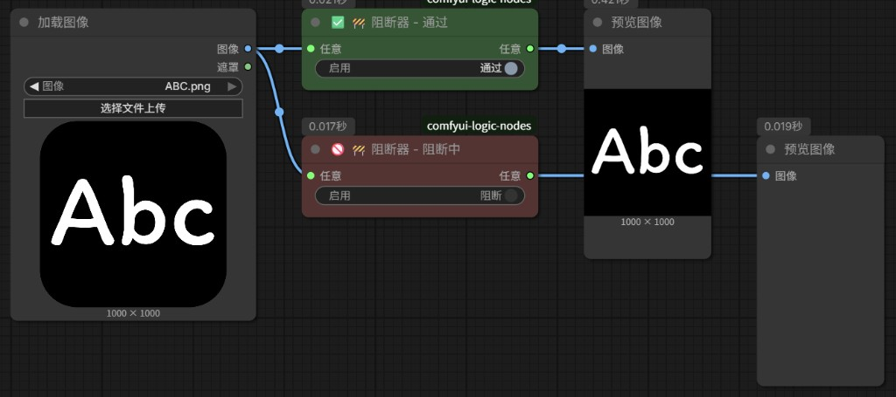

---

### 2. 👁️ 预览任意类型（Preview Type）

显示输入数据的类型名称和详细信息。  
*Display type name and details of input data.*

| 项目 | 内容 |
|------|------|
| 输入 | 任意类型 |
| 输出 | 无（纯预览节点） |
| 特性 | 彩色图标 + 类型名 + 详情，支持 IMAGE/MASK/LATENT/STRING/INT/FLOAT/BOOLEAN/CONDITIONING/DICT 及列表 |

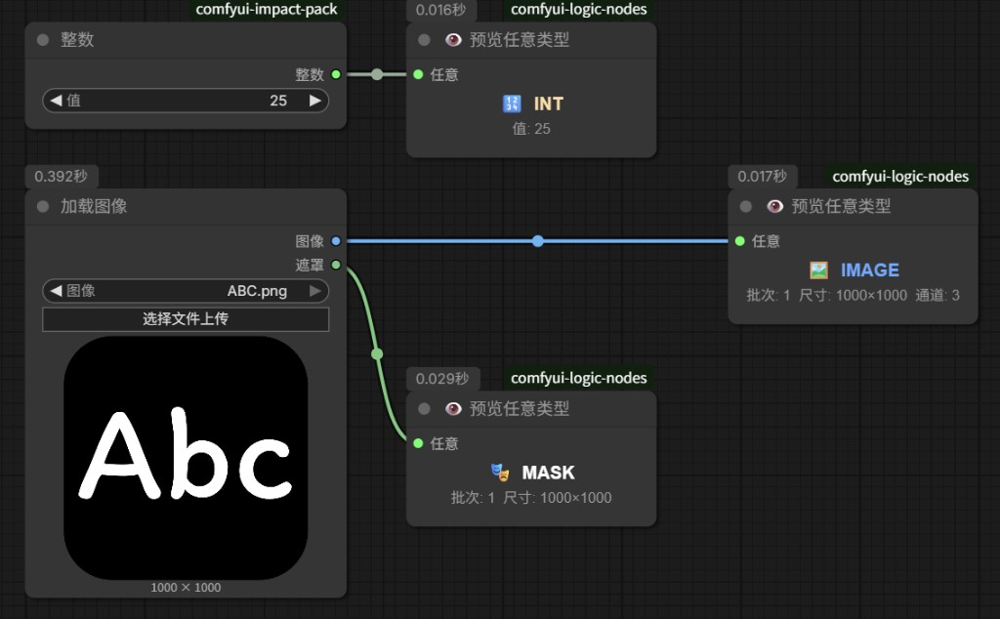

---

### 3. ⚖️ 判断器（Judge）

对两个任意类型的值进行条件判断，输出布尔结果。  
*Conditional comparison of two values, outputs boolean.*

| 项目 | 内容 |
|------|------|
| 输入 | 任意A（必填）+ 任意B（选填）+ 条件下拉菜单 |
| 输出 | BOOLEAN 结果 |
| 条件 | `A==B` `A!=B` `A>B` `A<B` `A>=B` `A<=B` `A包含B` `A为空` `A不为空` `A为真` `A为假` `长度==B` `长度>B` `长度<B` |
| 特性 | 节点颜色随判断结果变化（绿=真，红=假） |

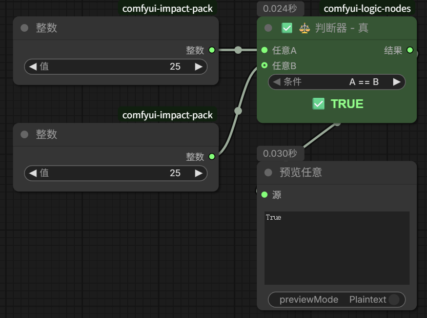

---

### 4. 🔀 条件切换（Switch）

根据布尔值从两个输入中选择一个输出。  
*Select one of two inputs based on boolean (if/else).*

| 项目 | 内容 |
|------|------|
| 输入 | 真（任意类型）+ 假（任意类型）+ 布尔条件 |
| 输出 | 条件为真输出"真"端，为假输出"假"端 |
| 特性 | 节点颜色随条件变化，实现 if/else 二选一 |

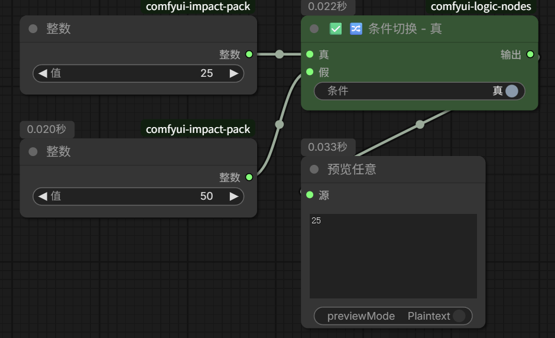

---

### 5. 🎚️ 切换器（Switcher）

从多个任意类型输入中选择一个输出，支持动态输入端口。  
*Select one output from multiple inputs by index, dynamic ports.*

| 项目 | 内容 |
|------|------|
| 输入 | 任意1~任意10（动态，按需增减）+ 选择（INT，可连接） |
| 输出 | 被选中的输入值，标签显示当前类型 |
| 特性 | 动态端口（连满自动加一个，断开自动收回，最少2个），选中端口标记 ▶，输出标签显示来源类型 |

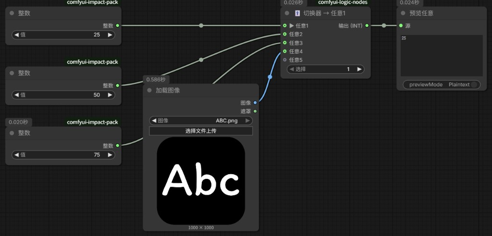

---

### 6. 🖥️ 通用预览（Universal Preview）

预览几乎所有 ComfyUI 支持的数据格式。  
*Preview images, masks, audio, text, latent, etc.*

| 项目 | 内容 |
|------|------|
| 输入 | 任意类型 |
| 输出 | 无（纯预览节点） |
| 特性 | 图片/遮罩直接显示，音频内置播放器可直接试听，文本/数字/布尔/列表/字典等格式化文本显示，Latent 显示尺寸信息 |

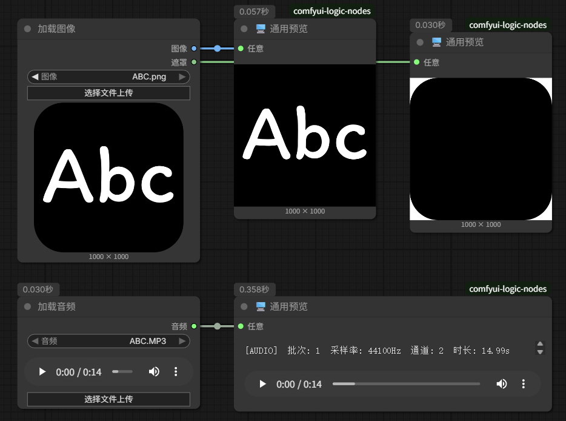

---

### 7. 📦 组合任意批次（Batch Combiner）

将多个输入按端口顺序合并为同一批次或拼接为一体。  
*Merge multiple inputs into one batch or concatenate.*

| 项目 | 内容 |
|------|------|
| 输入 | 任意1~任意10（动态端口） |
| 输出 | 合并后的数据 |
| 支持类型 | IMAGE/MASK（batch 维拼接，自动填充对齐不同尺寸）、LATENT（samples 拼接）、AUDIO（首尾拼接成一段，自动重采样+通道对齐）、LIST（顺序合并） |
| 特性 | 动态端口，执行后标题显示结果类型和详情（如 `AUDIO 6.28s 44100Hz`） |

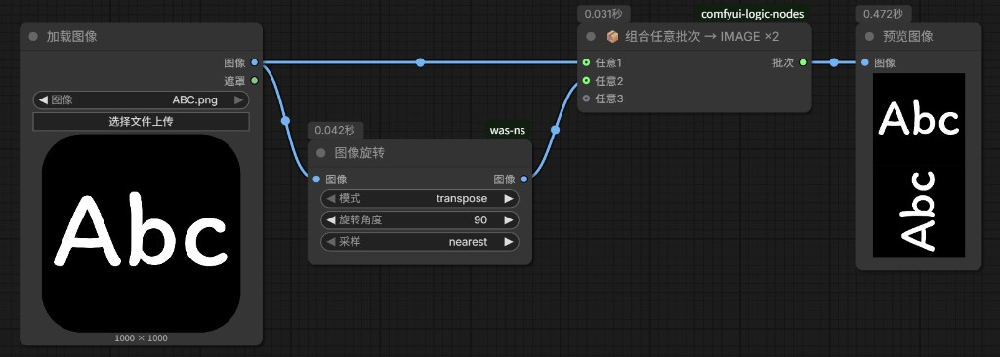

---

### 8. ⚙️ 批处理器（Batch Processor）

自动重复执行工作流指定次数，每次输出递增的索引。  
*Repeat workflow N times, output index and remaining count.*

| 项目 | 内容 |
|------|------|
| 输入 | 总次数（INT）+ 任意（可选透传） |
| 输出 | 任意（透传）、索引（当前第几次）、总次数、剩余次数 |
| 特性 | 执行后自动入队下一次，进度条实时显示，完成后自动停止，下次手动执行自动归零 |

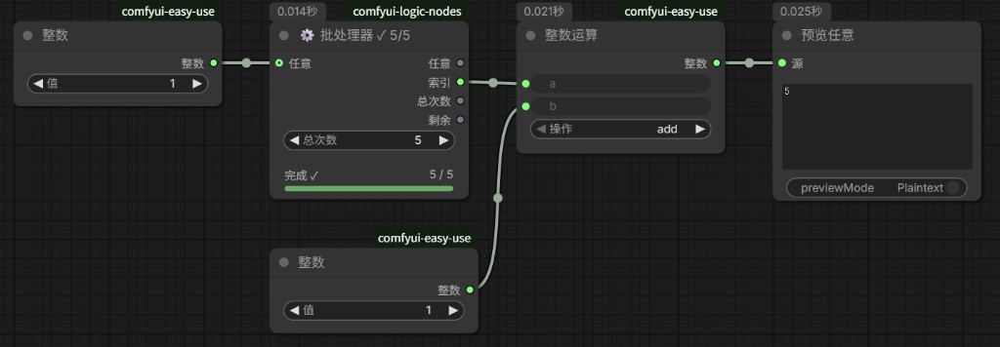

---

### 9. 🔄 类型转换（Converter）

将任意类型输入同时转换为字符串、整数、浮点数、布尔值四种基础类型，按需连接所需输出端口。  
*Convert any type to STRING/INT/FLOAT/BOOLEAN simultaneously.*

| 项目 | 内容 |
|------|------|
| 输入 | 任意类型 |
| 输出 | STRING（字符串）、INT（整数）、FLOAT（浮点数）、BOOLEAN（布尔值） |
| 转换规则 | 字符串：万物 `str()`；整数/浮点数：数值直接转、字符串尝试解析、列表/字典取长度；布尔值：`"false"/"0"/"no"/"none"/""/null` 为 False |
| 特性 | 执行后显示源类型和四种转换结果 |

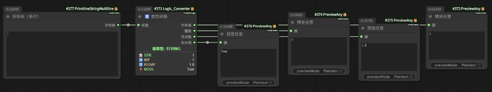

---

### 10. 🧮 数学表达式（Math Expression）

输入数学表达式，自动计算结果。支持动态可扩展输入端口（A~J）。  
*Evaluate math expressions with A~J variables, safe AST parsing.*

| 项目 | 内容 |
|------|------|
| 输入 | A~J 动态端口（任意类型，自动转数值）+ 表达式文本框 |
| 输出 | FLOAT（浮点数）、INT（整数）、BOOLEAN（布尔值，非零为 True） |
| 运算符 | `+` `-` `*` `/` `//` `%` `**` |
| 比较 | `==` `!=` `>` `<` `>=` `<=`（真=1.0，假=0.0） |
| 函数 | `sin` `cos` `tan` `asin` `acos` `atan` `atan2` `abs` `round` `ceil` `floor` `sqrt` `pow` `log` `log2` `log10` `min` `max` `clamp` |
| 常量 | `pi` `e` `inf` |
| 特性 | 动态端口（连满自动新增，断开自动收回），安全 AST 解析，执行后标题显示计算结果 |

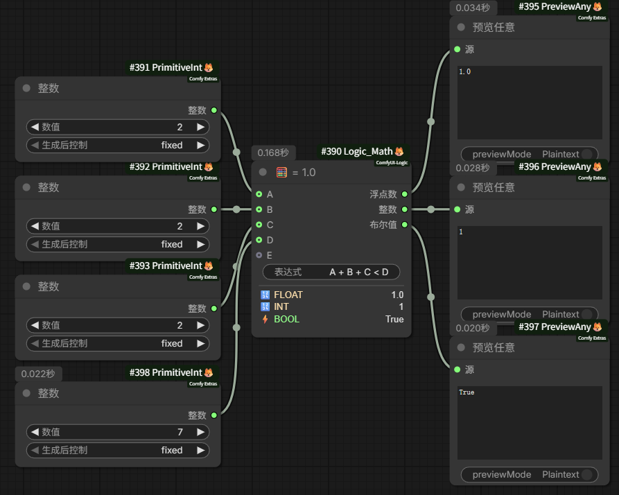

---

### 11. ✂️ 分解视频（Video Decompose）

将视频分解为图像帧、音频及元数据。支持 ComfyUI VideoInput 和文件路径输入。  
*Decompose video into frames, audio, and metadata. Multi-threaded decoding.*

| 项目 | 内容 |
|------|------|
| 输入 | 视频（VideoInput 或文件路径）+ 最大帧数（可选）+ 跳帧间隔（可选） |
| 输出 | IMAGE（图像帧）、AUDIO（音频）、FLOAT（时长、帧率）、INT（总帧数、宽度、高度） |
| 特性 | 多线程解码、单次遍历提取音视频、预分配张量，可设置最大帧数和跳帧间隔以提速 |

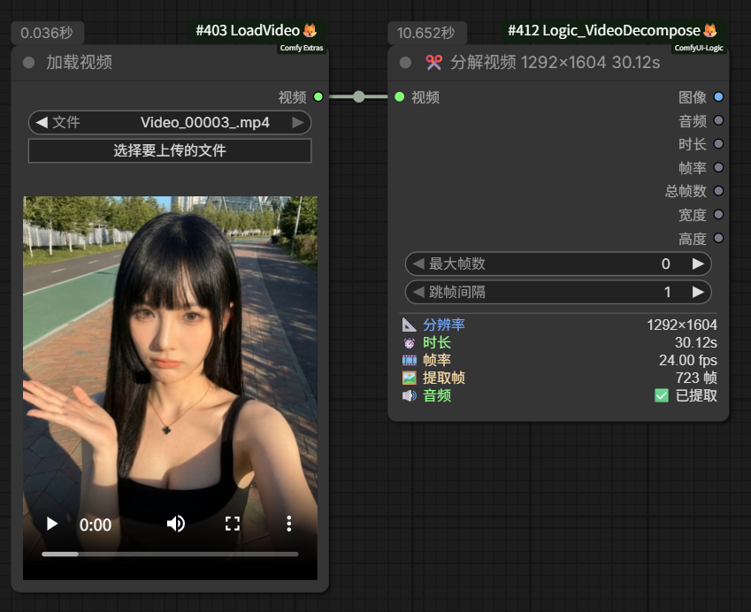

---

### 12. 🎞️ 合成视频（Video Compose）

将图像帧与音频合成为 ComfyUI 原生 VIDEO 对象。  
*Compose image frames and audio into ComfyUI VIDEO object.*

| 项目 | 内容 |
|------|------|
| 输入 | 图像（IMAGE）+ 帧率（FLOAT）+ 音频（AUDIO，可选） |
| 输出 | VIDEO（可连接保存/预览节点） |
| 特性 | 与分解视频节点配套使用，支持 H.264 编码 |

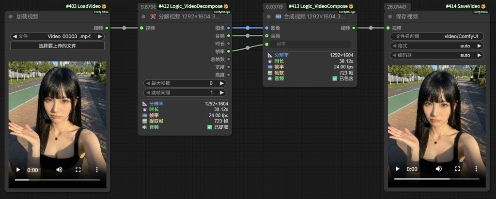

---

### 13. 🎲 随机工具（Random Tool）

生成各种随机数据。  
*Generate random integer, float, seed, or boolean.*

| 项目 | 内容 |
|------|------|
| 输入 | 模式选择 + 最小值/最大值（仅整数和浮点数模式可见） |
| 输出 | 随机值（类型随模式变化） |
| 模式 | 随机整数（自定义范围）、随机浮点数（自定义范围，6位小数）、随机种子（0~2⁶⁴）、随机布尔（True/False） |
| 特性 | 每次执行都生成新值，模式切换时自动显隐无关参数，标题实时显示生成结果 |

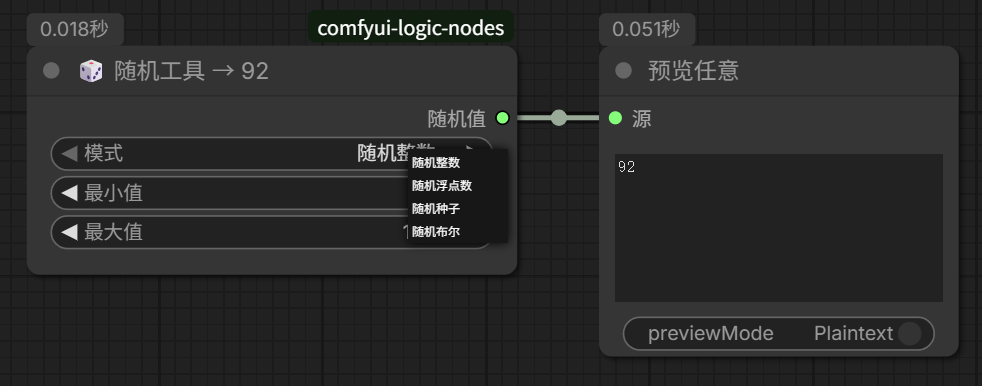

---

## 目录结构

```
ComfyUI-Logic/
├── __init__.py
├── README.md
├── pyproject.toml
├── assets/                  # 截图示例 Screenshots
├── locales/                 # i18n 多语言
│   ├── zh/                  # 中文
│   │   ├── main.json
│   │   └── nodeDefs.json
│   └── en/                  # English
│       ├── main.json
│       └── nodeDefs.json
├── nodes/
│   ├── __init__.py
│   ├── blocker.py           # 阻断器
│   ├── preview_any.py       # 预览任意类型
│   ├── judge.py             # 判断器
│   ├── switch.py            # 条件切换
│   ├── switcher.py          # 切换器
│   ├── preview.py           # 通用预览
│   ├── batch_combiner.py    # 组合任意批次
│   ├── looper.py            # 批处理器
│   ├── random_tool.py       # 随机工具
│   ├── converter.py         # 类型转换
│   ├── math_expression.py   # 数学表达式
│   ├── video_decompose.py   # 分解视频
│   └── video_compose.py     # 合成视频
└── web/
    └── js/
        ├── blocker_visual.js
        ├── preview_any_visual.js
        ├── judge_visual.js
        ├── switch_visual.js
        ├── switcher_visual.js
        ├── preview_visual.js
        ├── batch_combiner_visual.js
        ├── looper_visual.js
        ├── random_visual.js
        ├── converter_visual.js
        ├── math_visual.js
        ├── video_decompose_visual.js
        └── video_compose_visual.js
```

## 许可证

MIT License
